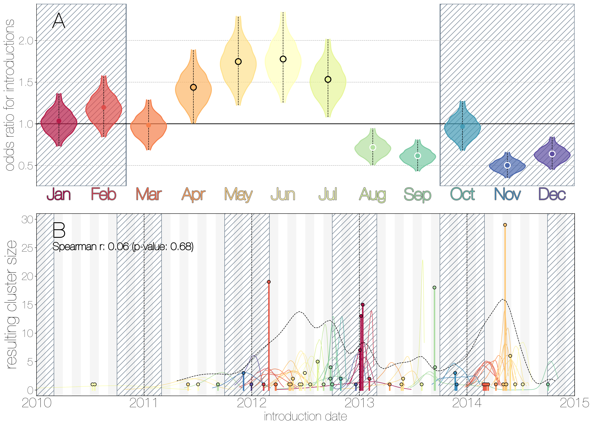
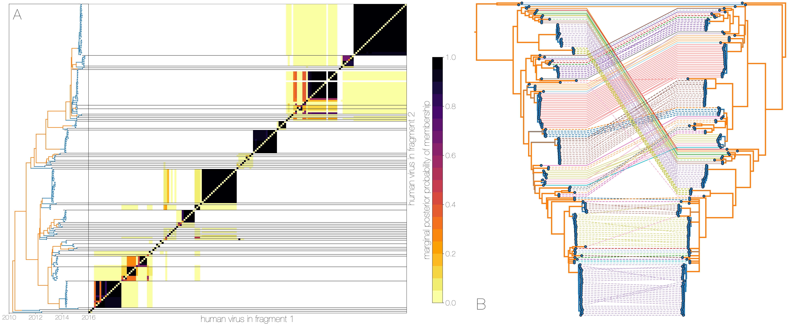
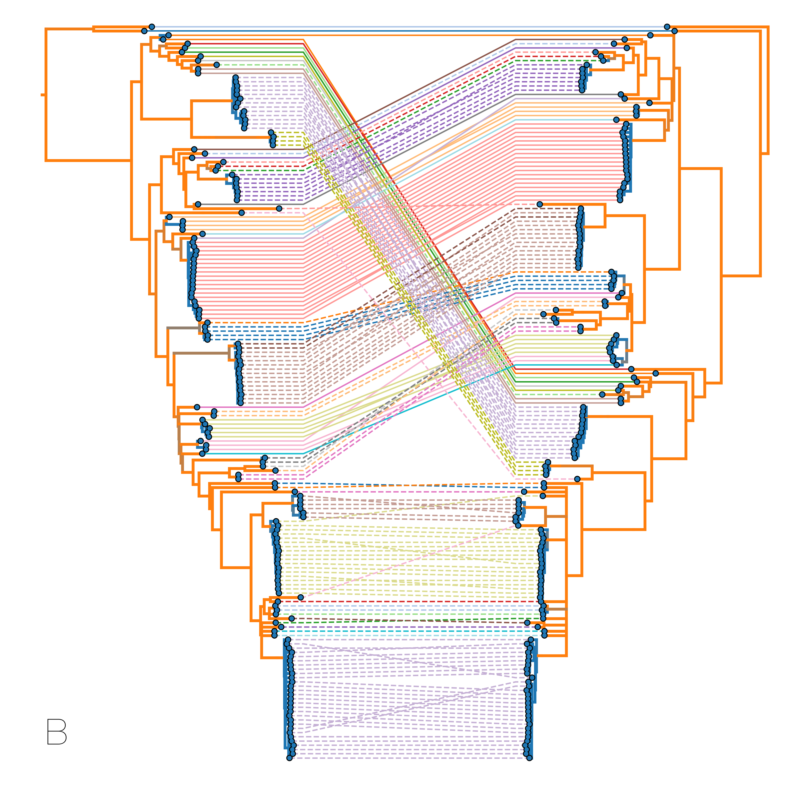

# MERS-CoV dynamics in camels and sporadic clusters in humans
Looking into MERS-CoV dynamics through the structured coalescent lens.

------------------------------

# Questions:
- What is the *actual* number of introductions of MERS-CoV into humans? Literature and WHO know the number >1.
- What can be estimated about an epidemic from sequence data and structure? A spin off of Zika in Florida work.
- Are MERS-CoV introductions seasonal? Would expect introductions to track prevalence in camels.

------------------------------
# Figures
### Main:

**Typed maximum clade credibility tree of MERS-CoV genomes from humans and camels.**

Maximum clade credibility (MCC) tree showing inferred ancestral hosts for MERS-CoV recovered with the structured coalescent.
Vast majority of MERS-CoV evolution is inferred to occur in camels (orange) with human outbreaks (blue) representing evolutionary dead-ends for the virus.
Confidence in host assignment is depicted as a colour gradient, with increased uncertainty in host assignment (posterior probabilities close to 0.5) shown as grey.
Some of the branches leading up to zoonotic transmission of MERS-CoV into humans are too long to have spent much of their time in humans, given our _a priori_ belief that MERS-CoV cannot circulate in humans for long periods of time.
Thus branches encompassing cross-species transmissions are depicted as being in camels right up to the common ancestor or tip of each human outbreak.
Whilst large clusters of human cases are apparent in the tree, significant contributions to human outbreaks are made by singleton sequences, likely representing recent cross-species transmissions that were caught early.

------------------------------

**MERS-CoV seasonality.**

A) Violin plots coloured by month showing the 95% highest posterior density interval for odds ratios of MERS-CoV introductions into human populations.
Posterior means are indicated with circles.
Evidence for increased or decreased risk (95% HPD excludes 1.0) for introductions are indicated by black or white circles, respectively.
Hatched area spanning October to February indicates the camel calving season.
B) Each clade entering humans is positioned based on the median introduction time, as recovered by structured coalescent analyses and coloured by time of year with height indicating number of descendent sequences recovered from human cases.
95% highest posterior density intervals for zoonotic introduction of MERS-CoV into human populations observed in the MCC tree are indicated with coloured lines, coloured by median estimated introduction time.
The black dotted line indicates the joint probability density for introductions.

------------------------------

**Results of Monte Carlo simulations.**

Each row corresponds to a different bias value used to concentrate the hypergeometric distribution that simulates sequencing, and goes from 1 (no bias) to 2, and 3 (increasing levels of bias).
Leftmost scatter plots show a 10% subsample of all outbreak and sequencing simulations, coloured by the R0 value used for the simulation.
The dotted rectangle identifies the 95% highest posterior density bounds for sequence cluster size mean and standard deviation observed for MERS-CoV data.
The distribution of R0 values found within the dotted rectangle is shown in the middle, on the same y axis across all levels of bias.
Bins falling inside the 95% percentiles are coloured by R0, as in the leftmost scatter plot.
The distribution of total number of introductions associated with simulations matching MERS-CoV sequence clusters is shown in the plots on the right, on the same y axis across all levels of bias.
Darker shade of grey indicates bins falling within the 95% percentiles.
Monte Carlo simulations indicate R0 for MERS-CoV is likely to be below 1.0, with biased sequencing and numbers of zoonotic transmissions numbering in the hundreds.

------------------------------

A) Heatmap shows the posterior probability that a pair of tips from trees of genomic fragments fall within the same clade - tips from fragment 1 are on the x axis, tips from fragment 2 are on the y axis.
Tips are ordered by their appearance in tree of genome fragment 2 (positions from nucleotide 21000 onwards) reduced to just the human tips and coloured by inferred host (blue for human, orange for camel) on the left.
Human clusters are largely well-supported as monophyletic and consistent across trees of both genomic fragments.

B) Phylogenies derived from MERS-CoV genome nucleotides up to position 21000 (left) and all nucleotides past position 21000 (right), reduced to just the human tips.
Same taxa are connected via coloured lines indicating their vertical position in the tree on the right.
Tree branches are coloured by inferred ancestral host state (human in blue, camel in orange).
Whilst some of apparent incongruities are caused by having less data in some of the fragments, inconsistencies between topologies occur across internal branches inferred to be in camels.
Human clusters in blue change phylogenetic positions between the trees wholesale, with minor incongruences within clusters.
This is evidence for recombinant viruses generated in the reservoir entering human populations.

------------------------------

### Supplementary:
- Exploded tree.
- Robustness of inference to choice of prior.
- Monte Carlo method.
- Monte Carlo simulations with twice as many cases.
- Recombination tests.
- Phylogenetically incomaptible loci.
- Clade sharing between trees of genome fragments.
- Camel skygrid.

------------------------------
